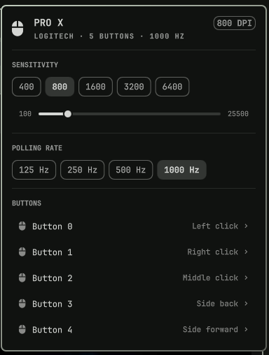

# Mousekit

A Logitech-Hub-shaped mouse panel for the [Omarchy](https://omarchy.org) bar,
built on [libratbag](https://github.com/libratbag/libratbag).

Sensitivity presets, polling rate, and button remapping — written straight to
the mouse's onboard memory, so the settings survive a reboot and follow the
mouse to another machine. No daemon of its own, no tray icon, no login.

The widget hides itself when no configurable mouse is connected, so on a
machine without one the bar looks exactly as it did before.



## What it does

| Surface | Action |
|---|---|
| Bar icon, left click | Open the panel |
| Bar icon, right click | Cycle to the next DPI preset |
| Bar icon, middle click | Re-read the mouse |
| Bar icon, scroll | Step DPI up/down through the supported values |
| Panel, **SENSITIVITY** | Pick a preset, or drag the slider to retune the active one |
| Panel, **POLLING RATE** | Switch report rate (125 / 250 / 500 / 1000 Hz, whatever the mouse supports) |
| Panel, **BUTTONS** | Remap any physical button to a DPI action, a mouse button, or a keyboard shortcut |

Inside the panel:

- `j` / `k` or arrows — move between rows
- `h` / `l` or left/right — move within a row (DPI presets, rates), or nudge the DPI slider
- `enter` / `space` — activate the current row
- `c` — cycle DPI preset
- `r` — refresh
- `n` — switch to the next mouse
- `esc` — close

## Requirements

`libratbag` — it provides both the `ratbagctl` CLI this plugin drives and the
`ratbagd` daemon that talks to the mouse:

```bash
omarchy pkg add libratbag
sudo systemctl enable --now ratbagd
```

Confirm your mouse is seen:

```bash
ratbagctl list
```

If that prints your mouse, the widget will pick it up within a minute (or
immediately on `omarchy-shell shell rescanPlugins`).

## Supported mice

Every device libratbag supports — several hundred models across Logitech,
Razer, SteelSeries, Roccat, ASUS, and others. Nothing in this plugin is
model-specific: the panel is built from whatever `ratbagctl info` reports, so a
mouse with two DPI presets and three buttons renders two presets and three
buttons, and one with five of each renders five.

Developed against a Logitech PRO X Superlight. If a device reports something
this plugin renders badly, the fix belongs in `Model.js` — see below.

### Device quirks it already handles

**A disabled active profile.** The PRO X reports five onboard profiles with
profile 1 flagged `(disabled) (active)`. `ratbagctl info` prints no body for a
profile it considers disabled, so `info` describes profile 0 — while every
write lands on profile 1, and the two hold genuinely different values. Reading
`info` naively shows 800 DPI on a mouse running at 1600.

So the probe compares `profile active get` against what `info` rendered, and
when they disagree it re-reads the active profile one item at a time
(`resolution N get`, `button N action get`), which the disabled flag does not
suppress. That path costs ~1.9s against ~0.12s for `info`, so it only runs on
devices that need it.

**Button numbering is evdev, not X11.** libratbag names button targets in
`BTN_*` order: `button 2` is right click and `button 3` is middle, the reverse
of X11. The PRO X's own factory mapping proves it — its physical right button
ships as `button 2`, and its side buttons as `button 4`/`button 5`
(`BTN_SIDE`/`BTN_EXTRA`).

**Wildly non-linear DPI lists.** The PRO X advertises 89 supported DPI values
from 100 to 25500, dense below 1000 and sparse above 6000. The slider walks
that list by index rather than by DPI, so the range people actually use gets
proportionate travel instead of the first 3% of the track.

## Install

```bash
omarchy plugin add https://github.com/Enoret/omarchy-mousekit.git --enable --yes
omarchy bar move io.github.enoret.mousekit --section right
```

Or by hand:

```bash
git clone https://github.com/Enoret/omarchy-mousekit.git ~/.config/omarchy/plugins/io.github.enoret.mousekit
omarchy-shell shell rescanPlugins
omarchy plugin enable io.github.enoret.mousekit right
```

## Remove

```bash
omarchy plugin remove io.github.enoret.mousekit --yes
```

That takes the widget off the bar and deletes
`~/.config/omarchy/plugins/io.github.enoret.mousekit/`. To take it off the bar but keep
it installed, use `omarchy plugin disable io.github.enoret.mousekit` instead.

Removing the plugin changes nothing on the mouse: DPI presets, polling rate,
and button mappings live in the mouse's own onboard memory, and this plugin
never stores a copy or restores one. If you want the factory mapping back,
set it explicitly before removing, or use `ratbagctl` directly afterwards.

`libratbag` is a normal system package and is left alone. To remove it too:

```bash
sudo systemctl disable --now ratbagd
sudo pacman -Rns libratbag
```

## Settings

Set these inline on the widget's entry in `~/.config/omarchy/shell.json`:

```json
{ "id": "io.github.enoret.mousekit", "refreshIntervalSec": 60, "alwaysShow": false, "device": "" }
```

| Key | Default | Meaning |
|---|---|---|
| `refreshIntervalSec` | `60` | How often to re-read the mouse. Minimum 5. |
| `alwaysShow` | `false` | Keep the bar icon visible even with no configurable mouse, instead of hiding it. |
| `device` | `""` | Pin a specific mouse by its `ratbagctl list` id. Empty means "the first one". |

## How it works

```
Panel.qml     bar icon + popup; all of the UI, built from qs.Ui primitives
Service.qml   device state and every write; owns the ratbagctl processes
Model.js      pure parsers for ratbagctl's output — no QML, unit-testable
bin/mousekit  the only place that shells out to ratbagctl
```

`bin/mousekit probe` gathers the whole device state in one call and prints a
flat `KEY=VALUE` + section blob; `bin/mousekit apply` performs one change.
Keeping the shell in a script rather than in QML strings means the ratbagctl
commands are readable and runnable by hand:

```bash
bin/mousekit probe
bin/mousekit apply "" dpi 1600
bin/mousekit apply "" button 3 special resolution-cycle-up
bin/mousekit apply "" button 4 macro +KEY_LEFTCTRL KEY_C -KEY_LEFTCTRL
```

`ratbagctl`'s own man page warns its output format is not guaranteed stable, so
every parser in `Model.js` is line-oriented and skips what it does not
recognise rather than failing.

## IPC

```bash
omarchy-shell io.github.enoret.mousekit toggle
omarchy-shell io.github.enoret.mousekit cycleDpi
omarchy-shell io.github.enoret.mousekit dpi 1600
omarchy-shell io.github.enoret.mousekit status
```

Handy as a Hyprland binding — a real DPI key on a mouse that has no DPI button:

```lua
o.bind("SUPER", "F9", "Cycle mouse DPI", "omarchy-shell io.github.enoret.mousekit cycleDpi")
```

## Contributing

The parsers are the part most likely to need a fix for an unfamiliar device.
They are plain JavaScript with no QML dependencies, so they run under node:

```bash
node test-model.js
```

Paste your `ratbagctl <device> info` output into a new case there, make it
pass, and the panel follows.

Two notes when iterating on the live shell:

- Editing a `.qml` file hot-reloads on save.
- Editing `Model.js` does **not** — the QML engine caches JS imports, so the
  shell keeps running the old parsers and the panel silently shows stale
  values. Run `omarchy restart shell` after touching it.

## License

MIT.
